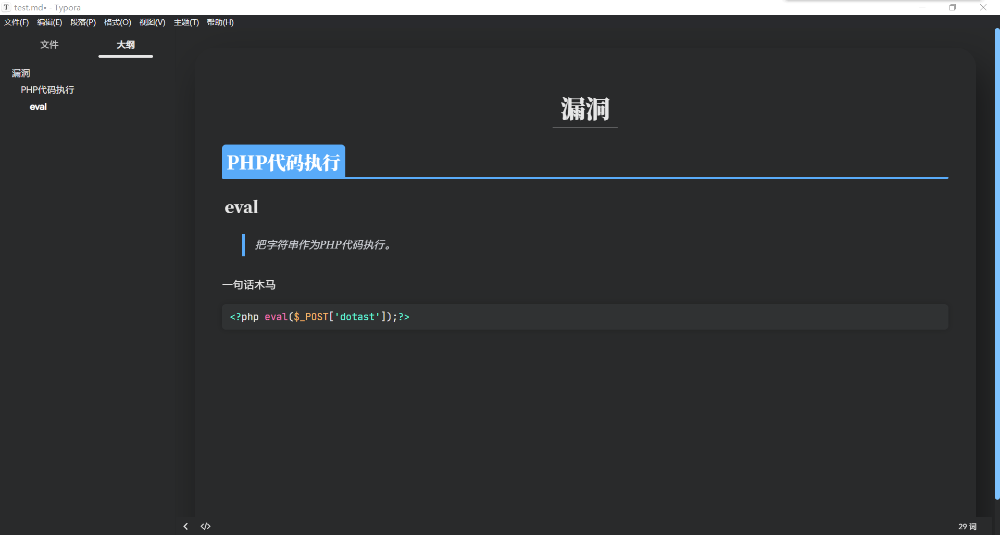

# Typora-Theme主题

## 闲言碎语

自用主题，在以下开源主题中按个人喜好修改而得，备份在github上
```
https://github.com/evgo2017/typora-theme-orange-heart
https://github.com/Adkinsm2020/typora-theme-panfrie/
```



## 使用方式

1. 文件-> 偏好设置 -> 外观 -> 打开主题文件夹
2. 下载后，把`dotast`文件夹和`dotast.css`放到该文件夹下
3. 重启typora，食用